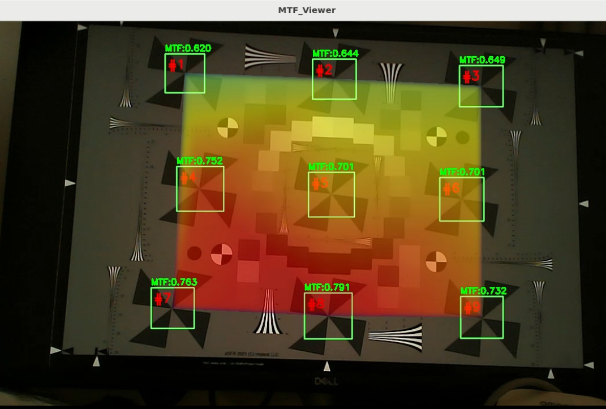
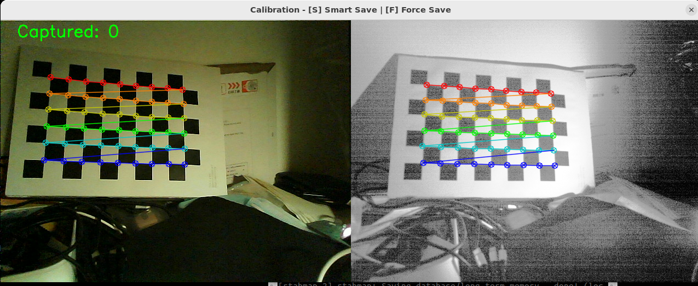
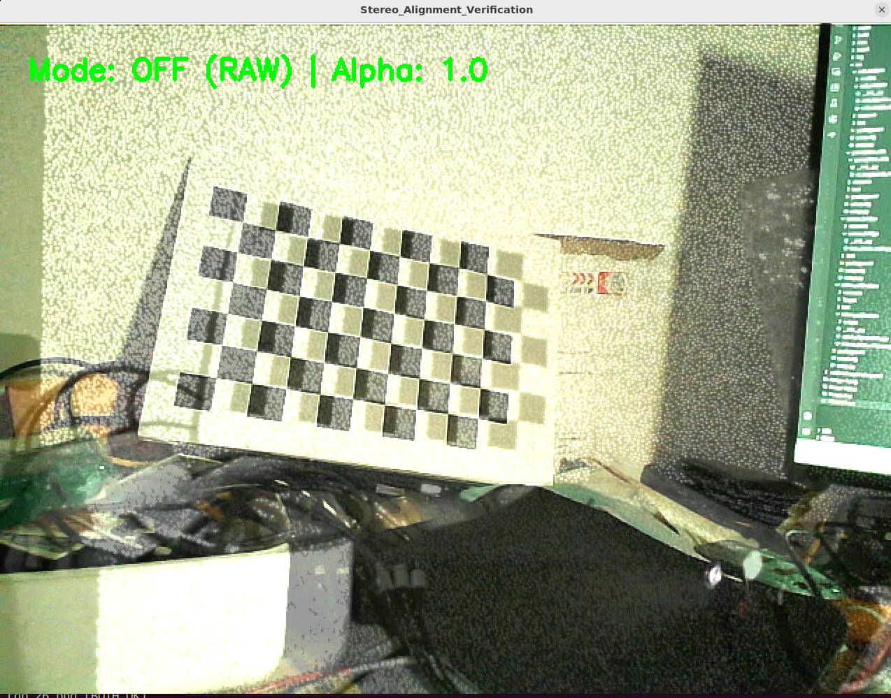
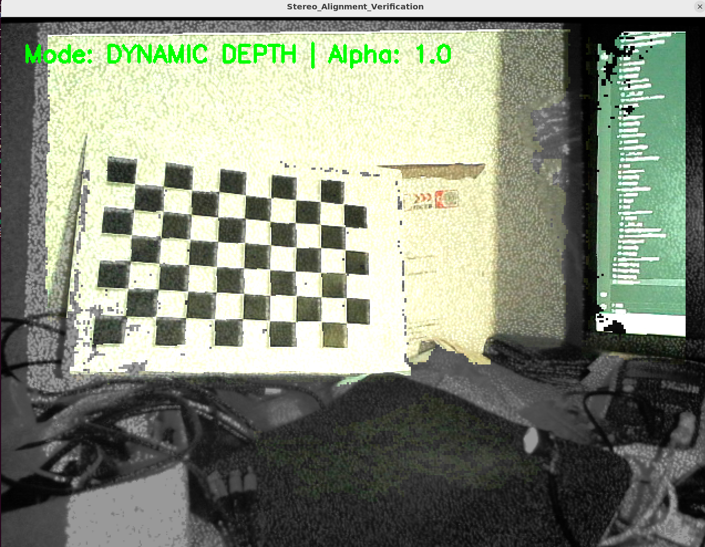
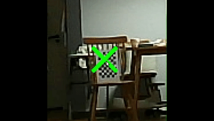
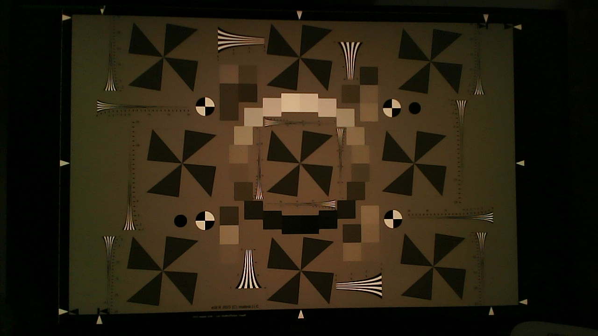

# VIST-Suite: 视觉-惯性传感器自动化评估平台

**VIST-Suite** (**V**ision-**I**nertial **S**ensor **T**esting Suite) 是一套针对机器人感知与自动驾驶模组设计的集成测试解决方案。以 Astra Pro 立体相机与 WIT 运动传感器为例，套件集成了全链路视觉预处理、多模态传感器校准及基于**ISO 12233:2023** 标准的（SFR/MTF）的实时计算模块。

## 系统架构 (System Architecture)

系统架构采用边缘端采集与计算端分析相分离的分布式架构，旨在解决高分辨率图像处理中的实时性瓶颈：

* **边缘端 (Edge Node)**：运行于 ROS2 环境，负责硬件驱动、图像预处理、基于 YOLO 的初步目标定位、UDP 数据分发及 IMU 数据的采集。
* **计算端 (Computing Center)**：对接 [VIST-Compute-Core](https://github.com/lei3zhang-collab/vist-compute-core) 引擎，执行 **ISO 12233:2023** 标准下的 MTF/SFR 推演、模型训练。

## 核心功能模块

### 1. MTF-Analyzer 光学质量评估

基于工业影像测试标准，提供镜头解析力（MTF@0.25cycles/pixel）实时评估：


*图：MTF Analyzer 实时分析界面，显示 ROI 锁定与热力图, 视频见 assets/MTF_Analyzer.mp4*

* 采用 YOLO26n 网络自动锁定视野内的 9 个标准采样区域 (ROI)。
* 数据传输层使用**同步阻塞式 UDP 通信**，将 9 个 150x150 ROI 区域转换为单通道亮度信号 (Y) 后上传至计算端，并在接收到 PC 端反馈后处理下一帧，确保了数据处理的确定性与时序一致性。
* 通过接收计算端回传的数据，利用 Scipy 库完成空间插值，生成二维 MTF 性能分布热力图。

### 2. Vision-Calibration 视觉校准与配准

* **解耦式内参标定 (Decoupled Intrinsic Calibration)**： 为了实现高精度的深度对齐（Depth-to-Color Registration），系统强制要求**分别计算 RGB 镜头与 IR (红外) 镜头的各自内参和畸变矩阵**。
* **RGB-IR 外参标定 (Stereo Calibration)**： 在获取各自内参后，通过双目标定算法计算 IR 相机相对于 RGB 相机的旋转矩阵 $R_{ir2rgb}$ 和平移向量 $t_{ir2rgb}$。这是实现物理坐标对齐的关键，通过求解以下方程建立两者的空间约束：
  
  $$
  P_{rgb} = R_{ir2rgb} \cdot P_{ir} + t_{ir2rgb}
  $$
  
  该步骤消除了双镜头间的物理偏差，是后续深度图重投影（Reprojection）至彩色图像坐标系的先决条件。


*图：RGB-IR 双镜头标定样本同步采集界面，采用 OpenCV 标准 9×6 棋盘格标靶，打印后固定在亚克力板上*

| **校准前 (Before)** | **校准后 (After)** |
| --- | --- |
|  |  |

* **VI-Lock 视觉-惯性 坐标系变换模组**： 执行 `IMU` 与相机光学坐标系之间的映射、IMU 姿态存储与插值、以及将旋转增量映射到相机系后对锁定点进行重投影的完整流程。
  
  * **坐标系定义与旋转变换**： IMU (Body): x右, y前, z上；Camera (Optical): x右, y下, z前。固定旋转矩阵 $R_{i2c}$ 定义为绕 X 轴旋转 +90°：
    
    $$
    R_{i2c}=\begin{bmatrix} 1 & 0 & 0\\ 0 & 0 & -1\\ 0 & 1 & 0 \end{bmatrix}
    $$
    
    通过四元数 $q$ 构造归一化旋转矩阵 $R(q)$，并以 $(t_{ns}, R)$ 形式存入循环缓冲（2s 长度）。
  * **相对旋转量与相似变换**： 计算 IMU 基座相对旋转 $R_{\Delta}^{imu}=R_{start}^T R_{current}$，随后通过相似变换映射至相机坐标系：
    
    $$
    R_{\Delta}^{cam}=R_{i2c}\,R_{\Delta}^{imu}\,R_{i2c}^T
    $$
  * **点跟随机制（反向旋转与重投影）**： 由于空间点在世界中静止，摄像机运动导致点在相机系中做“反向旋转”，利用 $(R_{\Delta}^{cam})^T$ 更新点坐标。
    
    1. **反投影**（像素 -> 相机坐标）：利用深度 $Z$ 与内参 $K_{ir}$ 计算 $x = (u - c_x) Z / f_x, y = (v - c_y) Z / f_y$。
    2. **重投影**（相机坐标 -> 像素）：$u = f_x \frac{x}{z} + c_x, v = f_y \frac{y}{z} + c_y$。通过亚像素插值确保 MTF 采样区域始终锁定在标靶特征点上。



*图：VI-Lock 动态目标锁定演示*

### 3. Sensor-Bridge 传感器驱动集成

* 深度支持 WIT 标准通讯协议，发布符合 `sensor_msgs/Imu` 标准的数据包。
* 负责 IMU 坐标系与相机坐标系的外参数自动变换，内部集成了四元数与欧拉角的转换逻辑，避免了万向锁 (Gimbal Lock) 问题。

## 操作指南

### 1. 环境准备

启动桌面端 [MTF-Master-Pro](https://www.google.com/search?q=https://github.com/your-username/MTF-Master-Pro) 监听程序。默认服务端口：5005（接收）/ 5006（发送）。

### 2. 边缘端部署

根据测试任务的不同，摄像头采用不同的启动策略：

#### 方案 A：常规视觉校准 (Calibration)

需同时启动相机节点与 IMU 驱动节点，确保视觉与惯性数据同步采集：

```bash
# 1. 启动相机驱动
ros2 launch astra_camera astra_pro.launch.xml

# 2. 启动 WIT IMU 驱动 (需确保串口权限已开启)
ros2 run sensor_bridge imu_driver --ros-args -p port:=/dev/ttyUSB0
```

#### 方案 B：MTF 光学性能测试 (推荐)

为保证测量精度，需先通过 V4L2 底层工具关闭 ISP 自动增强功能，并强制切换至高分辨率：

```bash
# 1. 调整底层参数：关闭自动白平衡、背光补偿，优化锐度设置 (驱动允许最低设为1)
v4l2-ctl -d /dev/video0 -c sharpness=1 -c backlight_compensation=0 -c white_balance_automatic=0

# 2. 以 1280x720 分辨率启动摄像头
ros2 launch astra_camera astra_pro.launch.xml color_width:=1280 color_height:=720

# 3. 启动分析与数据传输节点
ros2 run mtf_analyzer mtf_detector_udp_node
```

### 3. 离线样本采集与算法迭代

为了优化 YOLO 对标靶 ROI 的识别精度，系统提供了独立的样本采集机制，该流程与 MTF 实时计算逻辑解耦：

*图：eSFR 标靶捕获原图；标靶基于 ISO 12233:2023 标准的点对点4K显示优化（原生单色化映射）*

* **样本抓取（离线环境）**：
  
  * **操作方法**：在 `mtf_sample_capture` 运行且 OpenCV 预览窗口置顶时，按下 `S` 键。
  * **存储内容**：系统将抓取当前帧的 **1280x720 原始 RGB 图像**，保存至 `~/data/mtf_samples/`。
* **模型闭环迭代**：
  
  1. **数据导出**： 将原始图像同步至 PC 端标注工具。
  2. **重新训练**：利用 YOLO26n 训练新的检测模型并导出为 `.onnx` 格式。
  3. **部署更新**：将优化后的模型文件覆盖边缘端的推理路径，重启节点即可提升复杂光影下的 ROI 定位精度。

### 4. MTF实时计算核心系统配置参数

| **配置维度** | **边缘端 (ROS2 Node / Linux)** | **计算端 (Analysis Center / Windows)** | **说明与作用** |
| --- | --- | --- | --- |
| **网络地址** | 192.168.106.129 (Static) | 192.168.0.115 (Static) | 确保边缘端能精确指向计算端 IP |
| **UDP 端口** | 监听 5006 | 监听 5005 | 基于 UDP 协议的同步指令流传输 |
| **传输机制** | 同步阻塞式 (Acknowledge) | 请求/响应 (Request/Response) | 帧级时序对齐 |
| **采集规格** | 1280 × 720 (BGR8) | ROI 亮度信号: 150 × 150 (Y) | 保留最高采集精度，同时优化带宽 |
| **数据处理流** | YOLO 目标锁定 -> NMS ROI 筛选 -> 提取 Y 通道数据打包 -> 接收 MTF 结果 -> 实时热力图渲染 | 数据解包 (9-ROI) -> MTF 计算引擎调度 -> 计算结果回传 | 端到端的数据处理链路与计算负载分配 |

## 异常处理与维护须知

1. **网络通信故障**：若数据丢包，需确认防火墙规则是否允许 UDP 5005/5006 端口通过。
2. **目标检测偏移**：当光学靶标识别异常时，请利用离线采集的样本重新训练 ONNX 模型。
3. **资源释放规范**：节点已集成信号拦截机制。在接收到系统强制退出指令 (Ctrl+C) 时，程序会确保 OpenCV 窗口关闭、Socket 连接释放及内存清理，防止系统挂死。

## 联系方式

* **开发者**：Zhang Lei (上海交通大学 机械工程与自动化专业)
* **资历**：19 年跨国 Tier 1 项目管理与智能摄像头自动化测试开发经验
* **技术方向**：Teststand/LabVIEW/Python 并行自动测试平台架构开发、智能摄像头、计算机视觉、SFR算法、ROS2集成
* **联系邮箱**：<lei.3.zhang@gmail.com>
* **最后更新日期**：2026-02-19
